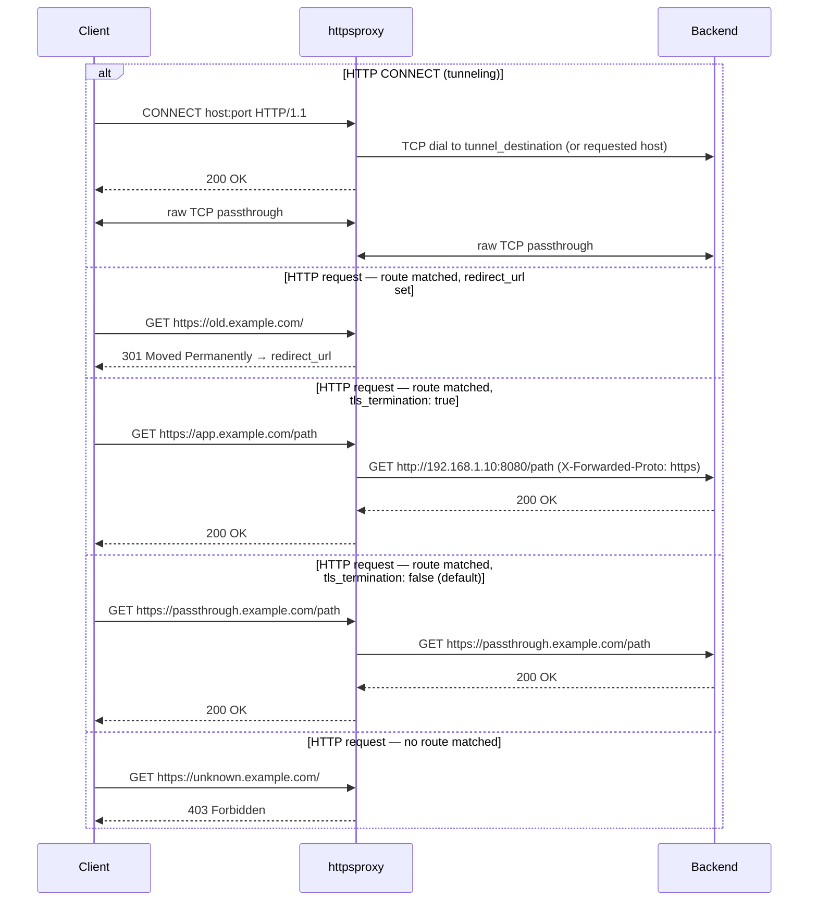

# httpsproxy

A lightweight HTTPS reverse proxy and TCP tunnel server written in Go. Routes incoming requests to backend services based on hostname patterns, with hot-reloadable configuration and syslog integration.

## Features

- **HTTPS/TLS termination** — accepts connections with custom certificates
- **Reverse proxy** — hostname-based routing to HTTP or HTTPS backends
- **301 redirects** — route rules can issue permanent redirects instead of proxying
- **HTTP CONNECT tunneling** — forwards CONNECT requests to a fixed or dynamic destination
- **Hot reload** — send `SIGHUP` to reload config and restart the listener with zero manual downtime
- **Syslog logging** — all request and error events go to syslog

## How it works



Routes are evaluated in order. The first matching route wins.

## Installation

### Prerequisites

- Go 1.21 or higher
- OpenSSL (for generating certificates)

### Build

```bash
git clone <repository-url>
cd httpsproxy
go build -o httpsproxy httpsproxy.go
```

## Quick start

### 1. Generate a self-signed TLS certificate

```bash
case `uname -s` in
    Linux*)  sslConfig=/etc/ssl/openssl.cnf ;;
    Darwin*) sslConfig=/System/Library/OpenSSL/openssl.cnf ;;
esac

openssl req \
    -newkey rsa:2048 -x509 -nodes \
    -keyout server.key -out server.crt \
    -subj /CN=localhost \
    -reqexts SAN -extensions SAN \
    -config <(cat $sslConfig <(printf '[SAN]\nsubjectAltName=DNS:localhost')) \
    -sha256 -days 3650
```

### 2. Write a config file

```yaml
server:
  port: 8443
  cert_file: server.crt
  key_file: server.key

syslog:
  tag: "httpsproxy"

proxy:
  dial_timeout: 10
  tunnel_destination: "10.0.0.1:22"

routes:
  - name: "app"
    host_contains: "app.example.com"
    tls_termination: true
    target_host: "192.168.1.10:8080"

default:
  denied_status: 403
  denied_message: "Forbidden"
```

### 3. Run

```bash
./httpsproxy -config config.yaml
```

## Configuration reference

### `server`

| Key | Type | Description |
|---|---|---|
| `port` | int | HTTPS listening port |
| `cert_file` | string | Path to TLS certificate |
| `key_file` | string | Path to TLS private key |

### `syslog`

| Key | Type | Description |
|---|---|---|
| `priority` | string | Syslog priority (e.g. `"LOG_INFO\|LOG_DAEMON"`) |
| `tag` | string | Syslog tag shown in log lines |

### `proxy`

| Key | Type | Description |
|---|---|---|
| `dial_timeout` | int | TCP connection timeout in seconds |
| `tunnel_destination` | string | Fixed `host:port` for CONNECT tunnels. Leave empty to forward to the client's requested destination. |

### `routes`

Routes are evaluated in order; the first match wins.

| Key | Type | Description |
|---|---|---|
| `name` | string | Label used in log output |
| `host_contains` | string | Match requests whose `Host` header contains this string |
| `redirect_url` | string | If set, respond with a redirect to this URL instead of proxying |
| `redirect_status` | int | HTTP status for the redirect (default: `301`) |
| `tls_termination` | bool | `true` → proxy to backend over **HTTP** and set `X-Forwarded-Proto: https`. `false` (default) → proxy over **HTTPS**. |
| `target_host` | string | Backend `host:port` |
| `use_original_host` | bool | Send the original `Host` header to the backend instead of `target_host` |

### `default`

| Key | Type | Description |
|---|---|---|
| `denied_status` | int | HTTP status returned when no route matches |
| `denied_message` | string | Response body when no route matches |

## Route examples

### Proxy to a plain-HTTP backend (TLS termination)

```yaml
- name: "app"
  host_contains: "app.example.com"
  tls_termination: true        # proxy over HTTP, add X-Forwarded-Proto: https
  target_host: "192.168.1.10:8080"
```

### Proxy to an HTTPS backend

```yaml
- name: "passthrough"
  host_contains: "secure.example.com"
  # tls_termination defaults to false — proxy over HTTPS
  use_original_host: true
```

### Permanent redirect

```yaml
- name: "old-site"
  host_contains: "old.example.com"
  redirect_url: "https://new.example.com"
  redirect_status: 301
```

## Signal handling

| Signal | Effect |
|---|---|
| `SIGHUP` | Reload `config.yaml` and restart the listener |
| `SIGTERM` | Graceful shutdown |

```bash
# Reload config
kill -HUP $(pgrep httpsproxy)

# Shut down
kill -TERM $(pgrep httpsproxy)
```

## Logging

All events are written to syslog under the configured tag.

```bash
# macOS
log show --predicate 'process == "httpsproxy"' --last 1h

# Linux (journald)
journalctl -t httpsproxy -f

# Linux (traditional syslog)
tail -f /var/log/syslog | grep httpsproxy
```

## Credits

Inspired by:
- https://medium.com/@mlowicki/http-s-proxy-in-golang-in-less-than-100-lines-of-code-6a51c2f2c38c
- https://gist.github.com/wwek/41790cbef2e33b6065eaea688ea54760
